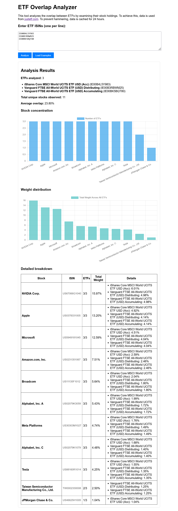

# ETF Overlap Analyzer

**Analyze overlap between ETFs to identify concentration risks and improve portfolio diversification.**



## 🚀 Quick Start

### Console Tool

```bash
# Install dependencies
pip install requests beautifulsoup4

# Analyze two ETFs
python etf_overlap.py --isin1 IE00B4L5Y983 --isin2 IE00B3RBWM25

# Analyze multiple ETFs
python etf_overlap.py --multi IE00B4L5Y983,IE00B3RBWM25,IE00BK5BQT80

# Get JSON output for integration
python etf_overlap.py --multi IE00B4L5Y983,IE00B3RBWM25 --json

# Expire cache and fetch fresh data
python etf_overlap.py --multi IE00B4L5Y983,IE00B3RBWM25 --expire-cache
```

### Web Interface

```bash
cd etf_web
pip install flask flask-limiter python-dotenv

# Copy .env.example to .env and set your password
cp .env.example .env
# Edit .env and set AUTH_PASSWORD

python app.py  # Runs on http://localhost:3003
```

## 📊 Features

### Core Analysis
- **Stock-Centric Analysis**: Identifies stocks appearing in multiple ETFs
- **Concentration Risk Detection**: Highlights over-concentration in specific stocks
- **Diversification Scoring**: Calculates 0-100 score based on overlap percentage
- **Interactive Visualizations**: Charts showing overlap patterns
- **JSON API**: Clean output for programmatic use
- **Caching**: SQLite caching with 24-hour expiry

### Advanced Capabilities
- **Multi-ETF Analysis**: Compare 2+ ETFs simultaneously
- **Pairwise Comparisons**: Detailed overlap matrix between all ETF pairs
- **Stock Overlap Analysis**: Shows stocks across multiple ETFs with total weights
- **Error Handling**: Robust validation and error reporting

### Web Interface Features
- **Interactive UI**: User-friendly interface with real-time analysis
- **Chart Visualizations**: Bar charts for concentration and weight distribution
- **Authentication**: HTTP Basic Auth for security
- **Rate Limiting**: 200 requests/day, 50/hour to prevent abuse
- **Detailed Breakdown**: Tabular view of stock overlap

## 📋 Requirements

- Python 3.7+
- Console: `requests`, `beautifulsoup4`
- Web: `flask`, `flask-limiter`, `python-dotenv`

## 📁 Files

```
.
├── etf_overlap.py          # Main analysis tool
├── etf_web/                # Web interface
│   ├── app.py              # Flask server with auth & rate limiting
│   ├── requirements.txt    # Web dependencies
│   ├── .env.example        # Environment config template
│   └── templates/index.html # Web UI with interactive charts
├── README.md               # This file
└── LICENSE                 # MIT License
```

## 🔧 Technical Details

### Diversification Scoring
The tool calculates a diversification score (0-100) based on total overlap percentage:
- **80-100**: Excellent diversification, minimal overlap
- **60-79**: Good diversification with some overlap
- **40-59**: Moderate overlap, consider adjustments
- **0-39**: High overlap, poor diversification

### Caching Mechanism
- Uses SQLite database (`etf_cache.db`)
- Data cached for 24 hours to reduce API calls
- Cache can be expired manually with `--expire-cache` flag

### Security Features
- **Input Validation**: Strict ISIN format validation (regex: `^[A-Z]{2}[A-Z0-9]{9}[0-9]$`)
- **Web Authentication**: HTTP Basic Auth required for web interface
- **Rate Limiting**: Prevents abuse of the web API

## 📖 API Documentation

### Console JSON Output Structure
```json
{
  "etfs": [
    {
      "isin": "IE00B4L5Y983",
      "name": "ETF Name",
      "holdings": [
        {
          "isin": "US0378331005",
          "name": "Apple Inc",
          "weight": 5.25
        }
      ]
    }
  ],
  "summary": {
    "total_etfs": 3,
    "average_overlap_percentage": 12.45,
    "total_unique_stocks": 150
  },
  "stock_overlap_analysis": [
    {
      "isin": "US0378331005",
      "name": "Apple Inc",
      "appears_in_etfs": 2,
      "total_weight_across_all_etfs": 8.75,
      "average_weight_per_etf": 4.38,
      "etf_breakdown": [
        {
          "etf_isin": "IE00B4L5Y983",
          "etf_name": "ETF 1",
          "weight": 5.25
        }
      ]
    }
  ]
}
```

### Web API Endpoint
```
POST /api/analyze
Content-Type: application/json

{
  "isins": ["IE00B4L5Y983", "IE00B3RBWM25"]
}
```

## ⚠️ Important Disclaimers

**NO FINANCIAL ADVICE**: This tool provides data analysis only. It does not provide financial advice or recommendations. Consult a qualified financial advisor before making investment decisions.

**SCRAPING RESPONSIBILITY**: This tool scrapes data from justetf.com. Users are solely responsible for complying with justetf.com's terms of service and applicable laws. Use at your own risk.

**DATA ACCURACY**: Results depend on data availability from justetf.com. Some ETFs may not have holdings information available.

## 🔧 Security Notes

- **Web Server**: Flask development server is not production-ready. Use with production WSGI server for deployment.
- **Input Validation**: Basic validation is implemented but additional hardening may be needed for public deployment.
- **Rate Limiting**: No rate limiting is implemented in console tool. Consider adding if exposing to public internet.
- **Authentication**: Web interface requires HTTP Basic Auth. Set `AUTH_PASSWORD` in `.env` file.

## 🛠️ Troubleshooting

**Common Issues**:
- **Invalid ISIN format**: Ensure ISINs are exactly 12 characters (2 letters + 9 alphanumeric + 1 digit)
- **No holdings data**: Some ETFs don't provide holdings information on justetf.com
- **Cache issues**: Use `--expire-cache` to force fresh data fetch
- **Web auth errors**: Ensure `.env` file exists with valid `AUTH_PASSWORD`

## 🤝 Contributing

Contributions are welcome! Please follow these guidelines:
- Fork the repository and create a feature branch
- Add comprehensive tests for new features
- Update documentation for any changes
- Submit pull requests with clear descriptions

## 📖 License

MIT License - See [LICENSE](LICENSE) for details.